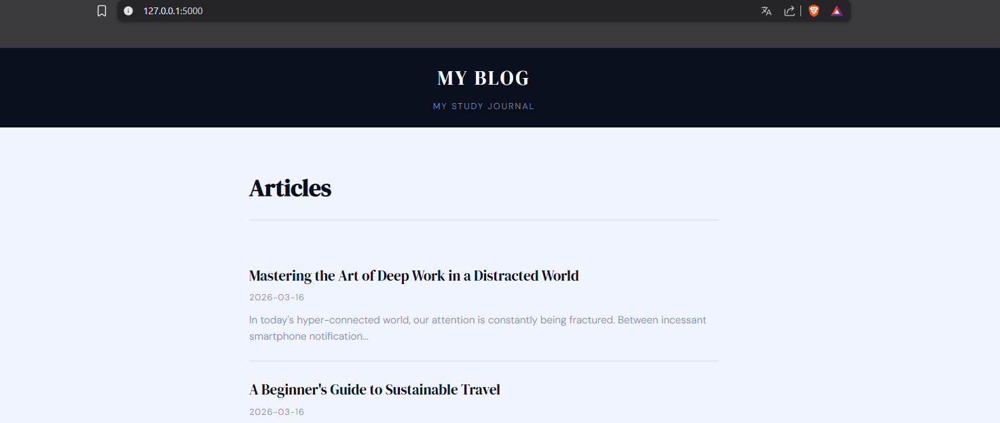
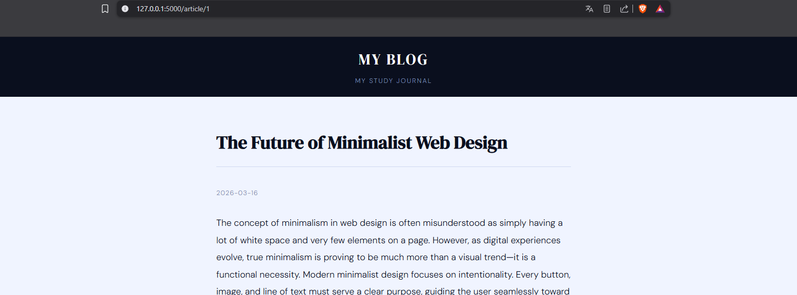
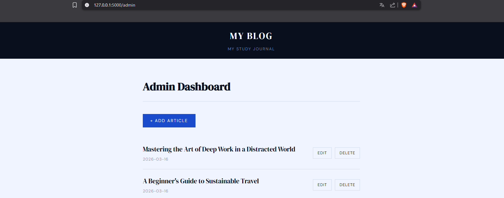
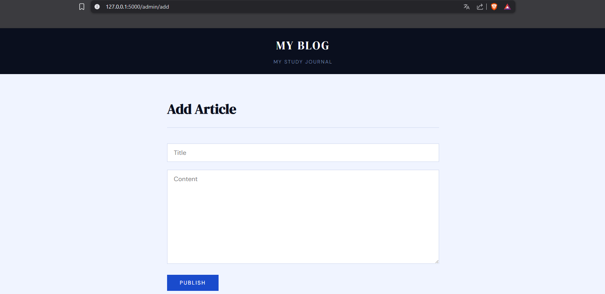

# Personal Blog

A personal blog web app with an admin panel for managing articles, built with Python and Flask. Articles are stored as JSON files.

## Requirements

- Python 3.6+
- Terminal

## Setup

This project is part of a larger repository with multiple projects. Clone the whole repo and navigate to this folder:

```bash
git clone https://github.com/eowannx/roadmapsh-python-projects.git
cd personal-blog
```

Create and activate a virtual environment:

```bash
# macOS / Linux
python -m venv venv
source venv/bin/activate

# Windows
python -m venv venv
venv\Scripts\activate
```

Install dependencies:

```bash
pip install -r requirements.txt
```

## Usage

```bash
python app.py
```

Then open http://127.0.0.1:5000 in your browser.

## Features

**Public**
- Home page with list of all articles
- Individual article pages

**Admin panel** (http://127.0.0.1:5000/admin)
- Login / logout
- Add, edit and delete articles

## Screenshots






## Project structure

```
personal-blog/
├── app.py
├── requirements.txt
├── README.md
├── .gitignore
├── articles/
├── screenshots/
│   ├── home.png
│   ├── article.png
│   ├── admin_dashboard.png
│   └── admin_add.png
└── templates/
    ├── base.html
    ├── home.html
    ├── article.html
    ├── login.html
    ├── 404.html
    └── admin/
        ├── dashboard.html
        ├── add.html
        └── edit.html
```

## Project Source

This project is based on the [Personal Blog](https://roadmap.sh/projects/personal-blog) challenge from [roadmap.sh](https://roadmap.sh).