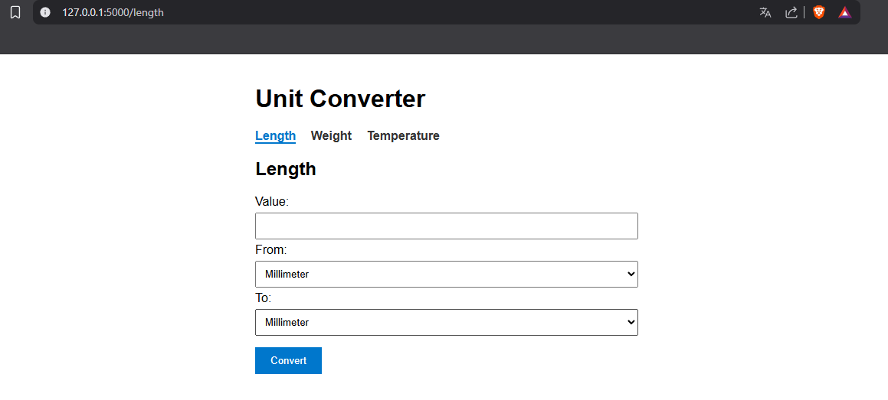
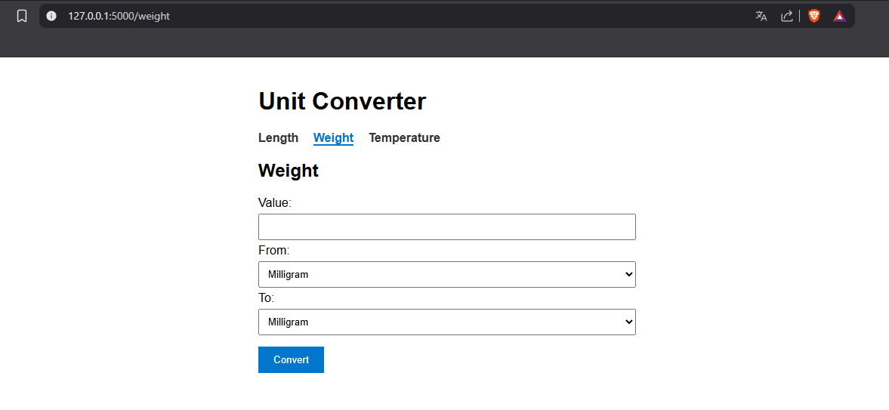
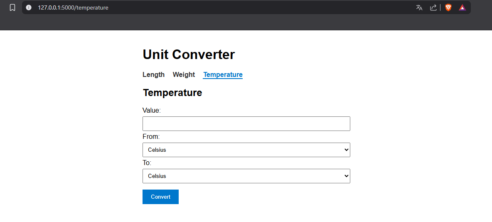

# Unit Converter

A web app for converting length, weight and temperature units, built with Python and Flask.

## Requirements

- Python 3.6+
- Terminal

## Setup

This project is part of a larger repository with multiple projects. Clone the whole repo and navigate to this folder:

```bash
git clone https://github.com/eowannx/roadmapsh-python-projects.git
cd unit-converter
```

Create and activate a virtual environment:

```bash
# macOS / Linux
python -m venv venv
source venv/bin/activate

# Windows
python -m venv venv
venv\Scripts\activate
```

Install dependencies:

```bash
pip install -r requirements.txt
```

## Usage

```bash
python app.py
```

Then open http://127.0.0.1:5000 in your browser.

## Screenshots







## Supported conversions

**Length:** millimeter, centimeter, meter, kilometer, inch, foot, yard, mile

**Weight:** milligram, gram, kilogram, ounce, pound

**Temperature:** celsius, fahrenheit, kelvin

## Project structure

```
unit-converter/
├── app.py
├── requirements.txt
├── README.md
├── .gitignore
├── screenshots/
│   ├── length.png
│   ├── weight.png
│   └── temperature.png
└── templates/
    ├── length.html
    ├── weight.html
    └── temperature.html
```

## Project Source

This project is based on the [Unit Converter](https://roadmap.sh/projects/unit-converter) challenge from [roadmap.sh](https://roadmap.sh).